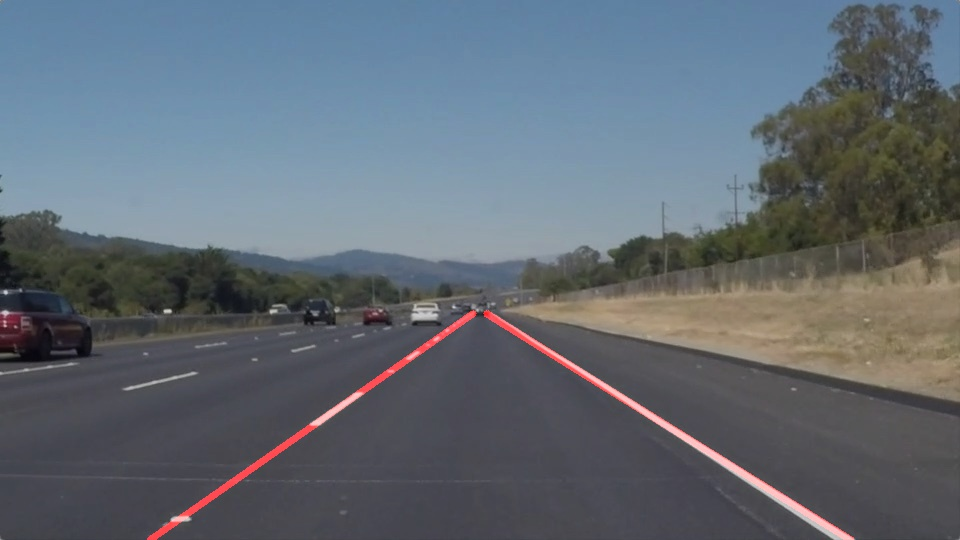

# **Finding Lane Lines on the Road** 

Overview
---

When we drive, we use our eyes to decide where to go.  The lines on the road that show us where the lanes are act as our constant reference for where to steer the vehicle.  Naturally, one of the first things we would like to do in developing a self-driving car is to automatically detect lane lines using an algorithm.

In this project lane lines are detected using Python and OpenCV.  OpenCV means "Open-Source Computer Vision".

### 1. The Lines-Finding Pipeline

The lines-finding pipeline consists of 7 steps.  
* Convert the images to grayscale
* Perform a gaussian blur to filter out noise
* Perform a gaussian blur to filter out noise
* Detect edges with Canny
* Keep only the edges in the region of interest. The region of interest is the portion of the frame where lane lines are expected.
* Find straight lines with Hough Transform.
* Extrapolate 2 lines to highlight the left and right boundary of the roadway.

In order to draw a single line on the left and right lanes, the draw_lines() function by had to be modified.
* Only the lines with slope of absolute value included between 0.82 and 0.49 have been considered. Horizontal and vertical lines have been discarded.
* The lines have been classified as belonging to the left or to the right boundary according to their slope. Positive slope means left and negative slope means right.
* The centers of the initial lines have been calculated. They are classified as centers belonging to the right lane and centers belonging to the left lane.
* A line is fitted through the centers. The centers of longer lines bare more weight.
* The starting point of the lines is the bottom of the frame.
* The end-point of the lines is the further point detected inside the region of interest. This value is prone to noise so its value is averaged through the last 15 runs.

### 2. Potential Shortcomings of the Current Pipeline

* If the color of the line is too similar to the color of the asphalt. The line is not detected.
* Sharp turns would result in a very short line. Curves have not been modelled in this project.
* Extreme light conditions would prevent the pipeline from detecting edges.
* It is not possible to change lane. During the transition the slopes would assume values outside the ones used as thresholds.
* If another car enters the area that is expected to be occupied by lanes the pipeline would not recognize them anymore and loose stability.  

### 3. Possible Pipeline Improvements

* A possible improvement would be to average not only the y-coordinate of the top point of the line, but also the slope of the lines over a number of runs.
* The pipeline could be improved to account for curves as in the advanced lane-finding project. 
